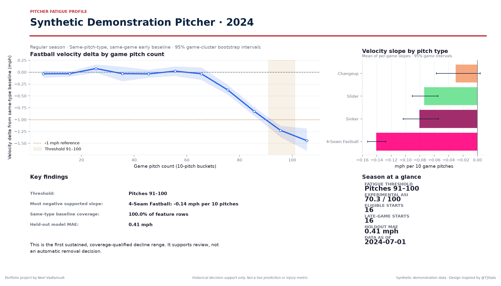
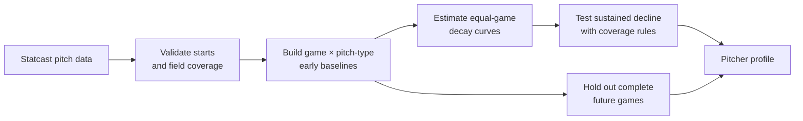

<div align="center">

# Pitcher Fatigue Profile

**Find where a starter's stuff begins to fade—and whether the evidence is strong enough to trust.**

A game-aware Statcast analysis and Streamlit dashboard for studying<br>
within-start velocity and pitch-quality changes.

<p><a href="https://github.com/NeelVadlamudi/pitcher-fatigue-profile/actions/workflows/ci.yml"></a>  </p>

<p>
  <a href="#the-30-second-read">The idea</a> ·
  <a href="#real-season-proof-logan-webb-2024">Real-season proof</a> ·
  <a href="#from-raw-pitches-to-a-decision-ready-profile">How it works</a> ·
  <a href="#run-it-locally">Run it</a>
</p>



</div>

> **Built for postgame analysis.** This project does not diagnose physiological
> fatigue, predict injury, or make an automatic pitching-change decision.

## The 30-second read

Most fatigue charts begin and end with a line that slopes downward. That is the
easy part.

The hard part is knowing whether the line reflects a real within-start change
or a mix of different pitch types, a handful of long outings, repeated pitches
from the same game, or survivor bias among pitchers who were allowed to stay in.

Pitcher Fatigue Profile asks one disciplined question:

> **At what pitch-count range does a starter show a sustained,
> coverage-qualified decline from his own early-game, same-pitch-type
> baseline?**

The result is a reviewable pitcher profile—not a black-box score. Every finding
ships with game coverage, uncertainty, held-out performance, and the data checks
needed to challenge it.

## Real-season proof: Logan Webb, 2024

The complete pipeline was run on Logan Webb's 2024 regular-season Statcast
record.

<table>
  <tr>
    <td align="center" width="25%">
      <strong>33</strong><br>
      <sub>eligible starts</sub>
    </td>
    <td align="center" width="25%">
      <strong>Not established</strong><br>
      <sub>supported 1 mph threshold</sub>
    </td>
    <td align="center" width="25%">
      <strong>0.75 mph</strong><br>
      <sub>held-out MAE</sub>
    </td>
    <td align="center" width="25%">
      <strong>0.02</strong><br>
      <sub>held-out R²</sub>
    </td>
  </tr>
</table>

The honest result was not a dramatic red flag. Webb's fastball averaged about
**0.9 mph below its same-game early baseline from pitches 71–90**, but no
pitch-count window cleared every support rule required to declare a clean
1 mph breaking point.

That non-finding matters. It keeps an appealing visual pattern from becoming a
claim the data cannot support. The held-out model also barely improved on its
naive baseline, so its individual-pitch predictions should be read as context,
not certainty.

**Inspect the evidence:** [validation record](outputs/validation/logan_webb_2024_validation.json) ·
[summary sheet](outputs/validation/logan_webb_2024_summary.png) ·
[validation notes](docs/validation_report.md)

## Built to survive scrutiny

| A tempting shortcut | What this project does instead |
|---|---|
| Compare every pitch to one blended velocity baseline | Builds baselines for each `game_pk × pitch_type` |
| Randomly split pitches into training and test sets | Keeps complete games together and holds out the latest games |
| Let 110-pitch outings overpower shorter starts | Averages within each game and bucket before averaging across games |
| Treat late-game samples as equally representative | Reports contributing games and start coverage in every bucket |
| Call the first noisy 1 mph crossing a threshold | Requires persistence, coverage, and a game-cluster bootstrap interval below zero |
| Present feature importance as a cause of decline | Labels it as model association and uses permutation importance |

These are not cosmetic safeguards. They determine whether the output describes
the pitcher or the shape of the dataset. The full estimands and equations are in
the [methodology](docs/methodology.md).

## From raw pitches to a decision-ready profile



The dashboard brings the analytical trail into one view:

- fastball velocity delta by game pitch count, with game-cluster uncertainty;
- velocity slope by pitch type;
- spin, movement, extension, and velocity-retention views;
- start coverage and late-game selection warnings;
- chronological held-out-game evaluation; and
- web PNG, print PNG, and feature-level CSV exports.

It opens with a deterministic synthetic pitcher, so the full experience can be
reviewed without an internet request. Live Statcast retrieval is available from
the sidebar.

## Run it locally

Python 3.11 is the supported runtime.

```bash
git clone https://github.com/NeelVadlamudi/pitcher-fatigue-profile.git
cd pitcher-fatigue-profile
python3.11 -m venv .venv
source .venv/bin/activate
python -m pip install -r requirements.txt
python -m pip install -e .
streamlit run app/streamlit_app.py
```

The app launches with bundled demonstration data. Select **Live Statcast** to
retrieve a pitcher-season; downloaded files are cached under `data/raw/` and
remain outside version control.

## Reproduce the evidence

```bash
# Run the automated checks
python -m pytest -q

# Rebuild and execute both analysis notebooks
python scripts/build_notebooks.py
python -m nbconvert --execute --to notebook --inplace \
  notebooks/01_data_quality_and_features.ipynb \
  notebooks/02_model_validation.ipynb \
  --ExecutePreprocessor.timeout=300

# Rebuild the real-player validation record
python scripts/validate_real_pitcher.py Logan Webb 2024
```

The published release contains **23 passing tests**, **75% branch-aware package
coverage**, two fully executed notebooks, and exception-free dashboard checks
for the synthetic sample and cached Logan Webb season.

### Review paths

| If you want to review… | Start here |
|---|---|
| Statistical definitions and equations | [Methodology](docs/methodology.md) |
| Real-player checks and observed results | [Validation report](docs/validation_report.md) |
| Intended use and model risk | [Model card](docs/model_card.md) |
| What each chart must communicate | [Chart contracts](docs/chart_contracts.md) |
| Release-readiness checks | [Pre-deployment review](docs/predeploy_review.md) |
| Executed exploratory work | [Data notebook](notebooks/01_data_quality_and_features.ipynb) and [model notebook](notebooks/02_model_validation.ipynb) |

<details>
<summary><strong>Repository anatomy</strong></summary>

```text
.
├── app/                    Streamlit interface
├── data/sample/            Deterministic offline demonstration
├── docs/                   Methods, validation, and chart contracts
├── notebooks/              Executed analysis walkthroughs
├── outputs/                Shareable figures and validation records
├── scripts/                Reproduction and export commands
├── src/pitcher_fatigue/    Tested analysis package
├── tests/                  Unit and integration checks
├── Dockerfile              Hugging Face Docker Space runtime
└── pyproject.toml          Package and test configuration
```

</details>

<details>
<summary><strong>Modeling boundary and known limitations</strong></summary>

The primary model predicts velocity delta using information available before a
pitch and evaluates on the latest complete games. A separate descriptive model
can use same-pitch measurements such as spin, extension, and movement to explain
associations; it is not a real-time forecast.

The experimental Arm Stamina Index summarizes threshold timing, late-fastball
retention, and between-game consistency. It is transparent but not
population-calibrated and has no injury-risk interpretation.

- Early baselines use the first 25 game pitches and are not known pregame.
- Statcast pitch labels and historical records can be revised.
- Warm-up pitches and other workload outside Statcast are unobserved.
- Pitchers who reach high counts remain a selected group, even when coverage is
  reported.
- Health status, between-game workload, weather, opponent, catcher, and intent
  are incomplete or absent.
- A single season can still be too small for some pitch types.

</details>

## Evidence base and credits

Pitch-level data come from
[Baseball Savant](https://baseballsavant.mlb.com) through
[pybaseball](https://github.com/jldbc/pybaseball). Field definitions follow the
official [Statcast CSV documentation](https://baseballsavant.mlb.com/csv-docs).

The project was scoped as historical decision support after reviewing published
work on pitcher workload and fatigue, including
[Bradbury and Forman (2012)](https://pubmed.ncbi.nlm.nih.gov/22344048/) and a
[systematic review of pitcher fatigue](https://pmc.ncbi.nlm.nih.gov/articles/PMC6673423/).
The pitch palette is adapted from Thomas Nestico's
[pitching_summary](https://github.com/tnestico/pitching_summary).

Built by **Neel Vadlamudi**. This independent portfolio project is not
affiliated with MLB, the Boston Red Sox, Baseball Savant, or the cited authors.
